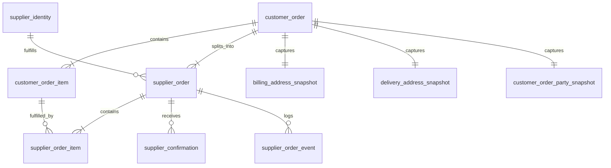
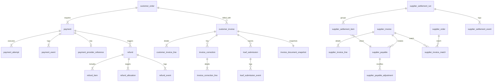
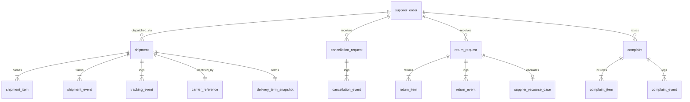
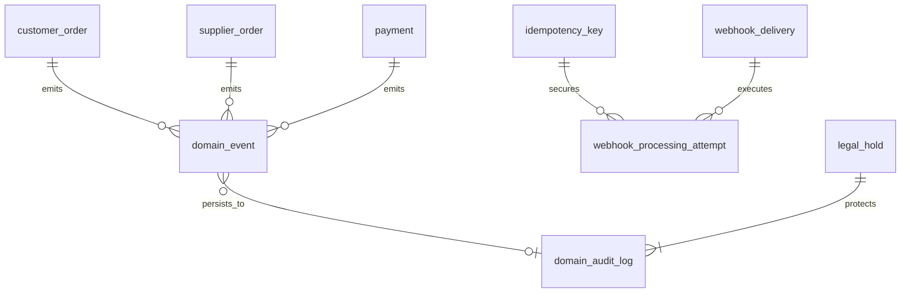

# LOGICAL ERD (LM-DROP-DATA-MODEL-56B0)

**Wersja:** 1.0.2
**Status:** PENDING_EXTERNAL_VALIDATION
**Moduł:** Dropshipping Logical Data Model

## 1. SCOPE AND SOURCE HIERARCHY

Niniejszy dokument przedstawia logiczny model danych w postaci relacyjnych diagramów (Entity-Relationship Diagrams) dla architektury dropshippingu MVP (Model A).

**Source Precedence Hierarchy:**
1. R2B approval and validation record
2. Normative Decision Register
3. Dropshipping Domain Contract
4. R2A supporting documents
5. CURRENT_REPOSITORY_FACT

Wszystkie wdrożenia produkcyjne oraz implementacje schematu (`56B1-56B6`) pozostają zablokowane ze statusem `BLOCKED_FOR_SCHEMA` do momentu uzyskania `FORMAL_EVIDENCE` (formalnych opinii prawnych, podatkowych, księgowych oraz od dostawców płatności).

## 2. CURRENT SCHEMA TO LOGICAL MODEL MAPPING

Odwzorowanie istniejących encji fizycznych na encje logiczne nowego modelu:

| Logical Entity | Current Physical Candidate | Classification |
| :--- | :--- | :--- |
| `customer_order` | `orders` | `EXISTING_EXTENSION` |
| `customer_order_item` | `order_items` | `EXISTING_EXTENSION` |
| `supplier_identity` | `partners` | `EXISTING_EXTENSION` (supplier_profile) |
| `offer_identity` | `offers` | `EXISTING_REUSE` |
| `cart_line` | `cart_items` | `EXISTING_REUSE` |
| `outbound_click` | `clicks` | `OUTSIDE_DROPSHIPPING_SCOPE` (`/go/[id]` wyłącznie click tracking) |

## 3. CORE MVP MERMAID ERD

## 4. FINANCE AND KSeF MERMAID ERD

## 5. FULFILLMENT AND RETURNS MERMAID ERD

## 6. AUDIT AND IDEMPOTENCY MERMAID ERD

## 7. TEXTUAL CARDINALITY MATRIX

Wszystkie relacje mają charakter normatywny dla definicji modelu (LOGICAL_MODEL_PROPOSAL).

| Relation ID | Source Entity | Target Entity | Source Min | Source Max | Target Min | Target Max | Lifecycle Condition | Ownership | Delete Behavior | Decision/Gate | Open Question |
| :--- | :--- | :--- | :--- | :--- | :--- | :--- | :--- | :--- | :--- | :--- | :--- |
| REL-01 | `customer_order` | `customer_order_item` | 1 | 1 | 1 | N | At creation | Owner | RESTRICT | `DEC-DROP-17` | |
| REL-02 | `customer_order` | `supplier_order` | 1 | 1 | 1 | N | At split | Owner | RESTRICT | `DEC-DROP-17` | |
| REL-03 | `customer_order` | `billing_address_snapshot` | 1 | 1 | 1 | 1 | At creation | Owner | RESTRICT | | |
| REL-04 | `customer_order` | `delivery_address_snapshot` | 1 | 1 | 1 | 1 | At creation | Owner | RESTRICT | | |
| REL-05 | `customer_order` | `customer_order_party_snapshot` | 1 | 1 | 1 | 1 | At creation | Owner | RESTRICT | | |
| REL-06 | `supplier_order` | `supplier_order_item` | 1 | 1 | 1 | N | At split | Owner | RESTRICT | `DEC-DROP-17` | |
| REL-07 | `supplier_order` | `supplier_confirmation` | 1 | 1 | 0 | N | On confirm | Owner | RESTRICT | `DEC-DROP-10` | |
| REL-08 | `supplier_order` | `supplier_order_event` | 1 | 1 | 0 | N | On event | Owner | RESTRICT | Audit | |
| REL-09 | `customer_order_item` | `supplier_order_item` | 1 | 1 | 0 | N | At split | Owner | RESTRICT | `DEC-DROP-17` | |
| REL-10 | `supplier_identity` | `supplier_order` | 1 | 1 | 0 | N | Always | Owner | RESTRICT | | |
| REL-11 | `customer_order` | `payment` | 1 | 1 | 1 | N | At creation | Owner | RESTRICT | | |
| REL-12 | `payment` | `payment_attempt` | 1 | 1 | 1 | N | On attempt | Owner | RESTRICT | | |
| REL-13 | `payment` | `payment_event` | 1 | 1 | 1 | N | On event | Owner | RESTRICT | | |
| REL-14 | `payment` | `payment_provider_reference` | 1 | 1 | 0 | 1 | On capture | Owner | RESTRICT | | |
| REL-15 | `payment` | `refund` | 1 | 1 | 0 | N | On return | Owner | RESTRICT | | |
| REL-16 | `refund` | `refund_item` | 1 | 1 | 1 | N | On return | Owner | RESTRICT | | |
| REL-17 | `refund` | `refund_allocation` | 1 | 1 | 1 | N | On return | Owner | RESTRICT | | |
| REL-18 | `refund` | `refund_event` | 1 | 1 | 1 | N | On event | Owner | RESTRICT | | |
| REL-19 | `customer_order` | `customer_invoice` | 1 | 1 | 0 | N | Post-payment | Owner | RESTRICT | `LEG-GATE-02` | `OMQ-CUSTOMER-INVOICE-MULTIPLICITY` |
| REL-20 | `customer_invoice` | `customer_invoice_line` | 1 | 1 | 1 | N | At creation | Owner | RESTRICT | | |
| REL-21 | `customer_invoice` | `invoice_correction` | 1 | 1 | 0 | N | On error | Owner | RESTRICT | | |
| REL-22 | `invoice_correction` | `invoice_correction_line` | 1 | 1 | 1 | N | At creation | Owner | RESTRICT | | |
| REL-23 | `customer_invoice` | `ksef_submission` | 1 | 1 | 0 | N | On report | Owner | RESTRICT | `LEG-GATE-02` | |
| REL-24 | `ksef_submission` | `ksef_submission_event` | 1 | 1 | 0 | N | On event | Owner | RESTRICT | | |
| REL-25 | `customer_invoice` | `invoice_document_snapshot` | 1 | 1 | 1 | 1 | At creation | Owner | RESTRICT | | |
| REL-26 | `supplier_invoice` | `supplier_invoice_line` | 1 | 1 | 1 | N | At import | Owner | RESTRICT | | |
| REL-27 | `supplier_invoice` | `supplier_payable` | 1 | 1 | 0 | N | On payable | Owner | RESTRICT | | |
| REL-28 | `supplier_payable` | `supplier_payable_adjustment` | 1 | 1 | 0 | N | On adjust | Owner | RESTRICT | | |
| REL-29 | `supplier_order` | `supplier_invoice_match` | 1 | 1 | 0 | N | On match | Reference | RESTRICT | | `OMQ-SUPPLIER-INVOICE-MATCHING` |
| REL-30 | `supplier_invoice` | `supplier_invoice_match` | 1 | 1 | 0 | N | On match | Reference | RESTRICT | | |
| REL-31 | `supplier_settlement_run` | `supplier_settlement_item` | 1 | 1 | 1 | N | At run | Owner | RESTRICT | | |
| REL-32 | `supplier_settlement_run` | `supplier_settlement_event` | 1 | 1 | 1 | N | On event | Owner | RESTRICT | | |
| REL-33 | `supplier_payable` | `supplier_settlement_item` | 1 | 1 | 0 | N | On run | Reference | RESTRICT | | |
| REL-34 | `supplier_order` | `shipment` | 1 | 1 | 0 | N | On dispatch | Owner | RESTRICT | `DEC-DROP-16` | |
| REL-35 | `shipment` | `shipment_item` | 1 | 1 | 1 | N | On dispatch | Owner | RESTRICT | `DEC-DROP-16` | |
| REL-36 | `shipment` | `shipment_event` | 1 | 1 | 1 | N | On event | Owner | RESTRICT | Fulfillment | |
| REL-37 | `shipment` | `tracking_event` | 1 | 1 | 1 | N | On event | Owner | RESTRICT | Fulfillment | |
| REL-38 | `shipment` | `carrier_reference` | 1 | 1 | 1 | 1 | On dispatch | Owner | RESTRICT | | |
| REL-39 | `shipment` | `delivery_term_snapshot` | 1 | 1 | 1 | 1 | On dispatch | Owner | RESTRICT | | |
| REL-40 | `supplier_order` | `cancellation_request` | 1 | 1 | 0 | N | On cancel | Owner | RESTRICT | | |
| REL-41 | `cancellation_request` | `cancellation_event` | 1 | 1 | 1 | N | On event | Owner | RESTRICT | | |
| REL-42 | `supplier_order` | `return_request` | 1 | 1 | 0 | N | On return | Owner | RESTRICT | | |
| REL-43 | `return_request` | `return_item` | 1 | 1 | 1 | N | On return | Owner | RESTRICT | | |
| REL-44 | `return_request` | `return_event` | 1 | 1 | 1 | N | On event | Owner | RESTRICT | | |
| REL-45 | `return_request` | `supplier_recourse_case` | 1 | 1 | 0 | 1 | On dispute | Owner | RESTRICT | | |
| REL-46 | `supplier_order` | `complaint` | 1 | 1 | 0 | N | On claim | Owner | RESTRICT | | |
| REL-47 | `complaint` | `complaint_item` | 1 | 1 | 1 | N | On claim | Owner | RESTRICT | | |
| REL-48 | `complaint` | `complaint_event` | 1 | 1 | 1 | N | On event | Owner | RESTRICT | | |
| REL-49 | `customer_order` | `domain_event` | 1 | 1 | 0 | N | On state | Emits | NO_ACTION | | |
| REL-50 | `supplier_order` | `domain_event` | 1 | 1 | 0 | N | On state | Emits | NO_ACTION | | |
| REL-51 | `payment` | `domain_event` | 1 | 1 | 0 | N | On state | Emits | NO_ACTION | | |
| REL-52 | `domain_event` | `domain_audit_log` | 0 | N | 0 | 1 | On persist | Persists | NO_ACTION | | |
| REL-53 | `idempotency_key` | `webhook_processing_attempt` | 1 | 1 | 0 | N | On hook | Secures | RESTRICT | | |
| REL-54 | `webhook_delivery` | `webhook_processing_attempt` | 1 | 1 | 0 | N | On hook | Executes | RESTRICT | | |
| REL-55 | `legal_hold` | `domain_audit_log` | 1 | 1 | 1 | N | On hold | Protects | RESTRICT | | |

## 8. AGGREGATE-ROOT MARKERS

| Aggregate Root | Purpose |
| :--- | :--- |
| `customer_order` | Owner of checkout intent, overall buyer context, buyer level items |
| `supplier_order` | Owner of fulfillment contract with specific supplier |
| `payment` | Financial capture orchestration |
| `refund` | Financial refund orchestration |
| `customer_invoice` | Document mapping for buyer taxation |
| `supplier_invoice` | Document mapping for wholesale trade payable |
| `supplier_payable` | Supplier liability tracking |
| `supplier_settlement_run` | Batch processing of supplier trade payables |
| `shipment` | Tracking execution unit |
| `cancellation_request` | Post-order but pre-shipment intent to stop |
| `return_request` | Post-delivery return |
| `complaint` | Quality claims and warranty |
| `domain_audit_log` | Audit core |

## 9. ENTITY LIFECYCLE CLASSIFICATION

- **Append-only log**: `domain_audit_log`, `domain_event`, `shipment_event`, `tracking_event`, `payment_event`, `webhook_delivery`
- **Immutable Snapshots**: `billing_address_snapshot`, `delivery_address_snapshot`, `customer_order_party_snapshot`, `invoice_document_snapshot`, `delivery_term_snapshot`
- **State Machine Nodes**: `customer_order`, `supplier_order`, `payment`, `refund`, `shipment`, `return_request`, `complaint`, `supplier_settlement_run`, `cancellation_request`

## 10. MVP VS POST-MVP BOUNDARY

- **MVP**: Online Immediate Capture, Proforma Prepayment, Parcel, Pallet, Domestic (PL), Trading Margin model.
- **POST-MVP**: Internal Trade Credit (`LM-DROP-CREDIT-57C`), Manual Freight Ecommerce, Deferred Freight Ecommerce, External B2B Financing.

## 11. EXCLUDED ENTITIES AND CAPABILITIES

- `freight_quote` (POST_MVP_LOGICAL_EXTENSION)
- automated supplier registration flow
- internal trade credit
- external financing provider tables
- marketplace payout splits / escrow balances

## 12. UNRESOLVED EXTERNAL-VALIDATION DEPENDENCIES

Poniższe kwestie posiadają status `PENDING_EXTERNAL_VALIDATION` i blokują wdrożenie:
- Merchant of Record (`LEG-GATE-01`)
- Seller of Record (`LEG-GATE-01`)
- Prawna własność środków (`LEG-GATE-05`)
- Proces refundacji (`LEG-GATE-11`)
- Zgodność P2B dla scoringu dostawców (`LEG-GATE-14`)
- Odpowiedzialność za błędy cenowe (`LEG-GATE-09`, `DEC-DROP-09`)
- Przepływ płatności (`LEG-GATE-10`)
