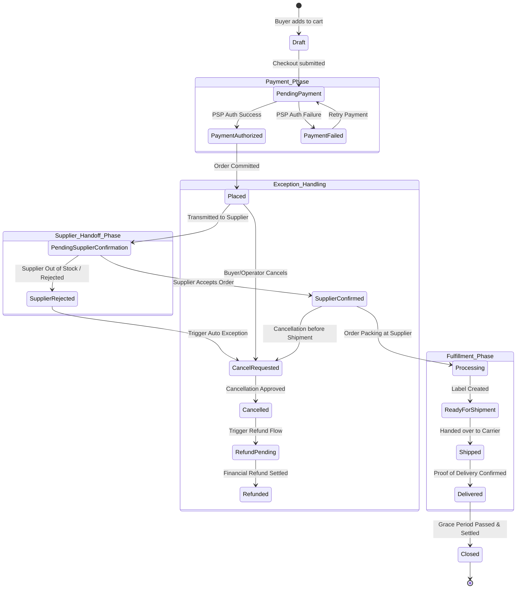
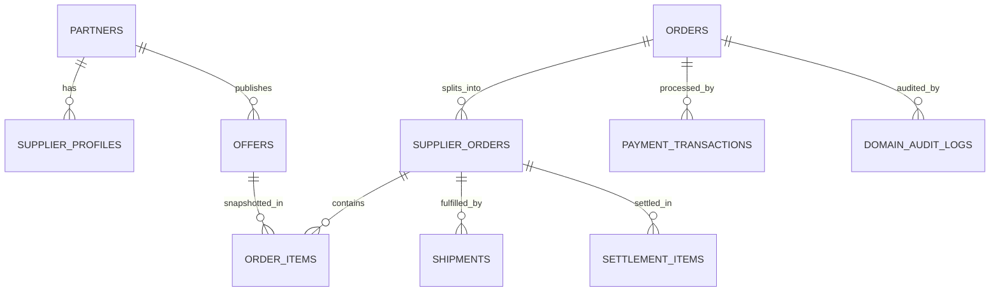

# LOGIMARKET — KONTRAKT BIZNESOWY I DOMENOWY DROPSHIPPINGU (LM-DROP-DOMAIN-56A)

**Wersja:** 1.0.0  
**Data:** 2026-07-22  
**Status:** PROPOSAL / SPECIFICATION FOR REVIEW  
**Moduł:** LogiMarket Marketplace Domain Contract  

---

## 1. EXECUTIVE SUMMARY

Niniejszy dokument stanowi specyfikację domenową i biznesową dla wprowadzania obsługi modelu **Dropshipping** w centralnie zarządzanym marketplace **LogiMarket**. 

Sprint **LM-DROP-DOMAIN-56A** jest etapem wyłącznie analityczno-architektonicznym. Nie wprowadzono żadnych zmian w kodzie źródłowym aplikacji, schemacie bazy danych (`/src/lib/schema.ts`) ani migracjach PostgreSQL.

### Kluczowe ustalenia architektoniczne:
1. **Niezależność od `offerModel`**: Dropshipping jest modelem realizacji zamówienia (`fulfillmentModel`), a nie sposobem wyliczania/konwersji na stronie oferty (`offerModel`). Istniejący polimorfizm `offerModel` (`rfq`, `ecommerce`, `outbound`) pozostaje nienaruszony. Model dropshippingowy w pierwszej fazie (MVP) dotyczy wyłącznie ofert o typie zakupu `offerModel = "ecommerce"`.
2. **Centralnie Zarządzany Marketplace (Operator-Centric MVP)**: LogiMarket w wersji MVP nie świadczy automatycznej rejestracji sprzedawców ani dostępu do odrębnego dostawczego panelu self-service. Wszystkie akcje partnerskie (oferty, dostawcy, zatwierdzenia, zamówienia dostawców) są procedowane, moderowane i rejestrowane przez operatora LogiMarket w module Admin MVP.
3. **Architektura Zamówień Wielopartnerskich**: Rekomendowany model zamówień zakłada podział głównego zamówienia kupującego (*Customer Order*) na pod-zamówienia dostawców (*Supplier Orders / Fulfillment Groups*), co zapewnia izolację statusów, wysyłek, śledzenia oraz rozliczeń dla poszczególnych partnerów dropshippingowych.

---

## 2. AUDYT STANU FAKTYCZNEGO (CURRENT-STATE AUDIT MATRIX)

Audyt przeprowadzono na repozytorium LogiMarket (`commit: 048b367bc3b6ddd4a426be4f526e9afe3952c1df`).

| CONCEPT | EXISTS | FILE_OR_TABLE | CURRENT_ROLE | REUSE_CANDIDATE | GAP / NIEDOBÓR MVP |
| :--- | :--- | :--- | :--- | :--- | :--- |
| `offerModel` | TAK | `src/lib/schema.ts` (`offers.offerModel`) | Określa model konwersji UI (`rfq`, `ecommerce`, `outbound`). | TAK (Zachować bez zmian) | Brak pola `fulfillmentModel` w `offers` do rozróżnienia stocku LogiMarket od dropshippingu. |
| `partners` | TAK | `src/lib/schema.ts` (`partners`) | Podstawowy rekord wydawcy oferty (`companyName`, `logoUrl`, `contactEmail`). | TAK | Brak atrybutów dropshippingowych (umowa, NIP, dane rozliczeniowe, adres zwrotów, czas realizacji SLA). |
| `suppliers / vendors` | NIE | BAZA / SCHEMAT | Brak osobnej tabeli dostawców. | NIE | Partner pełni funkcję dostawcy; wymagane rozszerzenie relacyjne lub profil dostawcy. |
| `cart` | TAK | `src/lib/schema.ts` (`cartItems`), `src/app/actions.ts` | Przechowywanie pozycji koszyka wg `sessionHash`. | TAK | Brak grupowania koszyka wg dostawców, brak kalkulacji kosztów dostawy per partner dropshippingowy. |
| `checkout` | TAK | `src/components/CheckoutModal.tsx`, `src/app/actions.ts` | Formularz danych B2B i tworzenia zamówienia w bazie. | TAK | Brak adresu dostawy (ulica, kod, miasto), brak NIP rozliczeniowego, brak wyboru dostawy/płatności. |
| `orders` | TAK | `src/lib/schema.ts` (`orders`) | Nagłówek zamówienia B2B (`companyName`, `contactName`, `email`, `totalAmount`, `status="new"`). | TAK | Brak szczegółowych adresów, statusów płatności/wysyłki/zwrotu, waluty, podatków i powiązań z dostawcami. |
| `orderItems` | TAK | `src/lib/schema.ts` (`orderItems`) | Pozycje zamówienia (`orderId`, `offerId`, `title`, `quantity`, `unitPrice`). | TAK | Brak historycznego kosztu zakupu (buy price), prowizji, snapshotu dostawcy i przypisania do *Supplier Order*. |
| `payments` | NIE | BAZA / SCHEMAT | Brak integracji bramki płatności i brak tabel transakcyjnych (np. Stripe). | NIE | Brak obsługi autoryzacji, pobrania środków (capture), zwrotów (refund) i rozbicia prowizji (split). |
| `shipments & tracking` | NIE | BAZA / SCHEMAT | Brak bazy przesyłek. Ścieżka `/go/[id]` służy **wyłącznie** do tracking kliknięć outbound! | NIE (nie używać `/go/[id]`) | Wymagana osobna struktura domenowa przesyłek (`shipments`) z kurierem, tracking number i historią dostawy. |
| `inventory & stock` | NIE | BAZA / SCHEMAT | Brak weryfikacji stanów magazynowych (tylko `isActive` i `publicationStatus`). | NIE | Brak kontroli stanów ilościowych, rezerwacji i wskaźników dostępności (lead time). |
| `settlement & commission` | NIE | BAZA / SCHEMAT | Brak rozliczeń z partnerami i naliczania prowizji. | NIE | Brak rejestrów prowizyjnych, historii wypłat (settlements) oraz dopasowywania faktur dostawców. |
| `cancellation / returns` | NIE | BAZA / SCHEMAT | Brak obsługi anulowań, zwrotów B2B oraz reklamacji. | NIE | Wymagane dedykowane maszyny stanów i obiekty zgłoszeń (*return_requests*, *complaints*). |
| `audit` | CZĘŚCIOWO | `src/lib/schema.ts` (`migrationBatches`) | Istnieją wyłącznie tabele audytu migracji atrybutów. | CZĘŚCIOWO (wzorzec) | Brak ogólnego rejestru zdarzeń domenowych dla zmian statusów zamówień i operacji finansowych. |
| `admin MVP` | NIE | BAZA / APLIKACJA | Brak panelu operacyjnego dla zespołu LogiMarket. | NIE | Wymagany kompletny centralny panel operatora do zarządzania dropshippingiem. |

---

## 3. RELACJA: OFFER MODEL VS FULFILLMENT MODEL

W architekturze LogiMarket oddzielamy pojęcie sposobu zakupu na marketplace od sposobu fizycznej realizacji zamówienia.

```
+-----------------------------------------------------------------------------------+
|                                 LOGIMARKET OFFER                                  |
+-------------------------------------------------+---------------------------------+
| offerModel (Model Interakcji / Konwersji)        | fulfillmentModel (Model Realizacji)
+-------------------------------------------------+---------------------------------+
| 1. rfq       -> Formularz zapytania ofertowego  | A. logimarket_stock (Magazyn własny)
| 2. ecommerce -> Dodaj do koszyka + Checkout     | B. dropship_supplier (Dostawca)
| 3. outbound  -> Przekierowanie zewnętrzne /go/   | C. external_fulfilled (Zewnętrzny)
+-------------------------------------------------+---------------------------------+
```

### Macierz Możliwych Kombinacji:

| offerModel | fulfillmentModel | Ocena Arkitektury / Zakres MVP |
| :--- | :--- | :--- |
| **ecommerce** | **dropship_supplier** | **GŁÓWNY ZAKRES DROPSHIPPING MVP.** Produkt zamawiany w koszyku LogiMarket, wysyłany bezpośrednio przez partnera dropshippingowego do kupującego. |
| **ecommerce** | **logimarket_stock** | **Wspierany.** Standardowy e-commerce z wysyłką z magazynu centralnego LogiMarket (jeśli dotyczy). |
| **rfq** | **dropship_supplier** | **Poza MVP.** Zapytania ofertowe wymagają indywidulanej wyceny i negocjacji. Mogą być realizowane w modelu dropshippingowym po akceptacji proformy, ale nie wchodzą w automatyczny checkout MVP. |
| **outbound** | **external_partner** | **Niezależne.** Przekierowanie przez `/go/[id]`. Transakcja i realizacja odbywają się w 100% poza ramy LogiMarket. `/go/[id]` nie tworzy zamówienia LogiMarket i nie może być używane do śledzenia przesyłek! |

---

## 4. KONTRAKT RÓL BIZNESOWYCH I MACIERZ RACI

### Zdefiniowane Role Domenowe:
1. **Kupujący B2B (Customer / Buyer)**: Podmiot gospodarczy składający zamówienie w LogiMarket, opłacający zamówienie i odbiorca przesyłki.
2. **Operator LogiMarket (Marketplace Operator)**: Centralny zespół LogiMarket zarządza katalogiem, umowami, weryfikuje zamówienia, zleca wysyłki dostawcom, kontroluje rozliczenia i obsługuje wyjątki.
3. **Partner Dropshippingowy (Supplier / Vendor)**: Podmiot zewnętrzny utrzymujący stock, pakujący i wysyłający towar bezpośrednio do Kupującego B2B na zlecenie Operatora.
4. **Przewoźnik (Carrier)**: Firma kurierska/logistyczna realizująca przewóz i dostarczająca dane statusowe tracking.
5. **Dostawca Płatności (Payment Service Provider / PSP)**: Podmiot procesujący płatność bezgotówkową (np. Stripe), autoryzacje, pobrania oraz zwroty środków.

### Macierz RACI (Responsible, Accountable, Consulted, Informed):

| Etap Procesu Zamówienia | Kupujący B2B | Operator LogiMarket | Partner Dropshippingowy | Przewoźnik | Dostawca Płatności |
| :--- | :---: | :---: | :---: | :---: | :---: |
| Składanie zamówienia i checkout | **R / A** | C | I | - | I |
| Autoryzacja i pobranie płatności | I | **A** | - | - | **R** |
| Weryfikacja zamówienia i przekazanie do dostawcy | I | **R / A** | C | - | - |
| Potwierdzenie dostępności i terminu (SLA) | I | A | **R** | - | - |
| Kompletacja i nadanie przesyłki | I | A | **R** | C | - |
| Wprowadzenie danych trackingowych | I | **A** | **R** | C | - |
| Transport i fizyczna dostawa | I | A | I | **R** | - |
| Obsługa anulowania (przed wysyłką) | R | **A** | C | - | C |
| Obsługa reklamacji / uszkodzeń w przesyłce | R | **A** | C | C | - |
| Rozliczenie prowizyjne i settlement dostawcy | - | **R / A** | C | - | C |

---

## 5. CYKL ŻYCIA ZAMÓWIENIA I ZDEKOMPONOWANA MASZYNA STANÓW

Aby uniknąć wąskich gardeł związanych z jedną kolumną statusu, zamówienie dropshippingowe opisane jest zestawem ortogonalnych statusów domenowych:

```
                          ZDEKOMPONOWANE STATUSY ZAMÓWIENIA
+-----------------------------------------------------------------------------------+
| 1. Order Status (Commerce):  draft -> placed -> processing -> completed -> cancelled|
| 2. Payment Status:           pending -> authorized -> captured -> refunded         |
| 3. Supplier Conf. Status:    unsubmitted -> pending -> confirmed -> rejected       |
| 4. Fulfillment Status:       unfulfilled -> processing -> shipped -> delivered     |
| 5. Return/Complaint Status:  none -> requested -> authorized -> resolved           |
+-----------------------------------------------------------------------------------+
```

### Diagram Przejść Stanów (Mermaid):



### Tabela Przejść Stanów Domenowych (Przykłady Kluczowych Przejść):

| FROM | EVENT | TO | ACTOR | PRECONDITIONS | SIDE_EFFECTS | AUDIT_EVENT |
| :--- | :--- | :--- | :--- | :--- | :--- | :--- |
| `draft` | `SUBMIT_CHECKOUT` | `pending_payment` | Buyer B2B | Cart not empty, Valid B2B address & NIP | Freeze cart snapshot, Create order header | `ORDER_CREATED` |
| `pending_payment` | `PAYMENT_AUTHORIZED` | `placed` | PSP Webhook | Auth token valid, Funds reserved | Send confirmation email to Buyer | `PAYMENT_AUTH_SUCCESS` |
| `placed` | `TRANSMIT_TO_SUPPLIER` | `pending_supplier_confirmation` | Operator / System | Supplier active, Product mapping OK | Generate Supplier Order record & notification | `SUPPLIER_ORDER_TRANSMITTED` |
| `pending_supplier_confirmation` | `SUPPLIER_CONFIRM` | `supplier_confirmed` | Operator (for Supplier) | SLA window active | Lock purchase price, Notify Buyer | `SUPPLIER_CONFIRMED` |
| `pending_supplier_confirmation` | `SUPPLIER_REJECT` | `supplier_rejected` | Operator (for Supplier) | Stock unavailable or price error | Mark item failed, Trigger cancellation & refund flow | `SUPPLIER_REJECTED` |
| `supplier_confirmed` | `DISPATCH_SHIPMENT` | `shipped` | Operator (for Supplier) | Valid tracking number & carrier set | Capture authorized payment, Send tracking link | `SHIPMENT_DISPATCHED` |
| `shipped` | `CARRIER_DELIVERED` | `delivered` | Carrier Webhook / Operator | Tracking status = Delivered | Start return/complaint grace window | `DELIVERY_CONFIRMED` |

---

## 6. MODEL ZAMÓWIEŃ WIELOPARTNERSKICH (MULTI-PARTNER ORDERS)

Przeanalizowano 3 warianty obsługi koszyka zawierającego towary od różnych partnerów dropshippingowych:

### Wariant A: Jedno Zamówienie, Wiele Fulfillment Groups
Jedno nadrzędne zamówienie z tablicą grup dostawy.
* *Zalety:* Prostota dla kupującego.
* *Wady:* Złożona struktura bazy i rozliczeń płatności w jednej tabeli.

### Wariant B: Master Customer Order + Sub-Supplier Orders (REKOMENDACJA MVP)
Kupujący płaci raz za **Master Customer Order** (`orders`). System automatycznie dzieli pozycje koszyka na odrębne **Supplier Orders / Fulfillment Groups** (`supplier_orders`), przypisane do poszczególnych `partner_id`.
* *Zalety:* Czysta izolacja statusów realizacji, przesyłek, faktur kosztowych i rozliczeń z każdym partnerem. Pozwala na częściowe anulowanie zamówienia jednego dostawcy bez blokowania dostaw od innych.
* *Wady:* Wymaga kalkulacji i podziału kosztów dostawy per dostawca na etapie checkoutu.

### Wariant C: Ograniczenie Koszyka do Jednego Dostawcy (Single-Supplier Restriction)
Koszyk blokuje dodanie produktów od drugiego dostawcy.
* *Zalety:* Ekstremalnie prosta implementacja w MVP.
* *Wady:* Słaby UX kupującego B2B, konfuzja przy próbie zakupu.

> **Rekomendacja MVP:** Wdrożenie **Wariantu B**. Kupujący widzi jeden checkout i reguluje jedną płatność, natomiast w tle Operator zarządza odrębnymi *Supplier Orders* dla poszczególnych partnerów.

---

## 7. KONTRAKT CENY, STANU I DOSTĘPNOŚCI (SNAPSHOT IMMUTABILITY)

Aby zapewnić spójność księgową i prawną, dane handlowe na zamówieniu nie mogą być wyliczane dynamicznie z aktualnego rekordu oferty `offers`, lecz muszą stanowić nieodwracalny **snapshot historyczny**.

```
+-----------------------------------------------------------------------------------+
|                               ORDER ITEM SNAPSHOT                                 |
+-----------------------------------------------------------------------------------+
| 1. offer_id_snapshot       -> Identyfikator oferty w momencie zakupu              |
| 2. partner_id_snapshot     -> Identyfikator partnera w momencie zakupu            |
| 3. title_snapshot          -> Pełna nazwa produktu z oferty                       |
| 4. sku_snapshot            -> SKU / EAN / Kod katalogowy dostawcy                 |
| 5. unit_sell_price_brutto  -> Cena sprzedaży dla kupującego (Gross Sell Price)    |
| 6. unit_buy_price_brutto   -> Cena zakupu od dostawcy (Gross Buy Price / Wholesale) |
| 7. commission_rate         -> Stawka prowizji LogiMarket (% lub kwota)            |
| 8. vat_rate                -> Stawka VAT (np. 23%)                                |
| 9. quantity                -> Zamówiona ilość                                     |
+-----------------------------------------------------------------------------------+
```

### Zasady Gwarancji Dostępności i Cen:
1. **Zamrożenie Ceny (Price Lock)**: W momencie złożenia zamówienia (`submitCheckout`), ceny zakupu i sprzedaży zostają zamrożone. Ewentualna zmiana ceny w katalogu partnera nie wpływa na złożone zamówienie.
2. **Rezerwacja Stanu**: W MVP z uwagi na brak bezpośrednich integracji API magazynów partnerów, wysłanie zamówienia do partnera stanowi zapytanie o potwierdzenie dostępności (SLA potwierdzenia np. 4h-24h).
3. **Ochrona przed Oversellingiem**: Jeśli partner odrzuci zamówienie ze względu na brak stanu (`supplier_rejected`), system automatycznie zwalnia autoryzację płatności i informuje Kupującego.

---

## 8. PRZEKAZANIE ZAMÓWIENIA DO PARTNERA (SUPPLIER HANDOFF)

Ze względu na ograniczenia biznesowe MVP (brak portalu dostawcy i braku automatycznych API/EDI w 1. fazie):

```
+-----------------------------------------------------------------------------------+
|                             SUPPLIER HANDOFF FLOW (MVP)                           |
+-----------------------------------------------------------------------------------+
| 1. System tworzy rekord `supplier_orders` w stanie `pending_supplier_confirmation` |
| 2. System generuje powiadomienie e-mail / zamówienie PDF do Partnera               |
| 3. Operator LogiMarket w Admin MVP nadzoruje status i czas odpowiedzi (SLA)        |
| 4. Partner potwierdza dostępność e-mailem / telefonicznie                          |
| 5. Operator zmienia status zamówienia w Admin MVP na `supplier_confirmed`          |
+-----------------------------------------------------------------------------------+
```

### Minimalizacja Danych Przekazywanych Partnerowi:
Partner dropshippingowy otrzymuje **wyłącznie** dane niezbędne do realizacji wysyłki (PII Minimization):
* Imię, nazwisko / nazwa firmy odbiorcy;
* Adres dostawy (ulica, kod, miasto, kraj);
* Telefon kontaktowy dla kuriera;
* Numery SKU, nazwy i ilości zamawianych towarów;
* Numer zamówienia dostawcy (*Supplier Order Reference*).

*Partner NIE otrzymuje:* kwoty cen sprzedaży dla kupującego, wysokości prowizji LogiMarket ani danych płatności kupującego.

---

## 9. WYSYŁKA I TRACKING (SHIPMENT & TRACKING CONTRACT)

Dla obsługi logistyki dropshippingowej definiuje się encję domenową `shipments`:

```
+-----------------------------------------------------------------------------------+
|                                 SHIPMENT AGGREGATE                                |
+-----------------------------------------------------------------------------------+
| - id: bigserial                                                                   |
| - supplier_order_id: bigint (FK do supplier_orders)                               |
| - carrier_code: varchar (np. "dhl", "dpd", "inpost", "geodis", "own_transport")   |
| - carrier_name: varchar (np. "DHL Express", "InPost Kurier")                      |
| - tracking_number: varchar                                                        |
| - tracking_url: varchar                                                           |
| - dispatched_at: timestamp                                                        |
| - estimated_delivery_at: timestamp                                                |
| - actual_delivery_at: timestamp                                                   |
| - proof_of_delivery_url: varchar                                                  |
| - status: varchar ("manifested", "in_transit", "delivered", "exception")          |
+-----------------------------------------------------------------------------------+
```

> **Ważne rozróżnienie:** Trasa `/go/[id]` jest wyłącznie mechanizmem śledzenia kliknięć w oferty typu *Outbound* i pod żadnym pozorem nie może być wykorzystywana jako link śledzenia przesyłki kurierskiej!

---

## 10. ANULOWANIA, REFUNDY, ZWROTY I REKLAMACJE (B2B EXCEPTION HANDLING)

W relacjach B2B zasady zwrotów i reklamacji różnią się od konsumenckich (brak ustawowego 14-dniowego odstąpienia od umowy bez podania przyczyny, chyba że umowa partnerska stanowi inaczej).

### Matryca Obsługi Wyjątków:

| Proces | Inicjator | Zatwierdzający | Skutek Finansowy | Skutek Magazynowy | Skutek dla Partnera |
| :--- | :--- | :--- | :--- | :--- | :--- |
| **Anulowanie przed wysyłką** | Kupujący / Operator | Operator | Zwrot 100% środków (Pełny Refund) | Anulowanie rezerwacji u dostawcy | Anulowanie *Supplier Order* |
| **Odrzucenie przez dostawcę** | Partner / Operator | System / Operator | Zwrot 100% środków (Auto Refund) | Brak | Oznaczony brakiem stanu |
| **Uszkodzenie w transporcie** | Kupujący B2B | Operator | Refund lub ponowna wysyłka | Protokół szkody z przewoźnikiem | Wszczęcie procedury reklamacyjnej z kurierem partnera |
| **Wada jakościowa / Towar niezgodny** | Kupujący B2B | Operator & Partner | Reklamacja / Refund / Wymiana | Odsyłka do magazynu Partnera | Obciążenie Partnera / Korekta settlementu |
| **Zwrot umowny B2B** | Kupujący B2B | Operator & Partner | Partial / Full Refund po potrąceniu kosztów | Odsyłka na adres zwrotów Partnera | Korekta rozliczenia prowizyjnego |

---

## 11. PŁATNOŚCI I SETTLEMENT (FINANCIAL ARCHITECTURE)

### Wybrany Model Finansowy: Merchant of Record (MoR) / Centrally Collected
LogiMarket działa jako podmiot pobierający płatność od kupującego i wystawiający fakturę/potwierdzenie sprzedaży, a następnie rozlicza się z Partnerem Dropshippingowym na podstawie faktury hurtowej Partnera.

```
+-----------------------------------------------------------------------------------+
|                             FINANCIAL FLOW MATRIX                                 |
+-----------------------------------------------------------------------------------+
| 1. BUYER pays LogiMarket (Brutto Sell Price + Shipping) via PSP                   |
| 2. LogiMarket holds funds in PSP account                                          |
| 3. SUPPLIER dispatches order and issues Wholesale Invoice to LogiMarket           |
| 4. LogiMarket retains Commission = (Sell Price - Buy Price)                       |
| 5. LogiMarket executes Settlement payout to Supplier per contractual terms (e.g. 14 days) |
+-----------------------------------------------------------------------------------+
```

---

## 12. ADMIN MVP (CENTRALNY PANEL OPERATORA)

Admin MVP jest modułem wewnętrznym przeznaczonym wyłącznie dla pracowników i operatorów LogiMarket.

### 15 Modułów Funkcjonalnych Centralnego Panelu Operatora:

1. **Partnerzy Dropshippingowi**: Zarządzanie profilami partnerów, danymi kontaktowymi, NIP i statusem aktywacji.
2. **Umowy i Status Aktywacji**: Weryfikacja podpisanych umów dropshippingowych, stawek prowizyjnych i SLA.
3. **Oferty Dropshippingowe**: Moderacja i akceptacja ofert dopuszczonych do modelu realizacji dropshipping.
4. **Ceny Zakupu i Sprzedaży**: Weryfikacja cen brutto/netto, wyliczanie marży i kontrola rentowności.
5. **Stany i Dostępność**: Ręczna lub półautomatyczna aktualizacja dostępności towarów partnerów.
6. **Zamówienia Kupujących (Customer Orders)**: Podgląd wszystkich złożonych zamówień, statusów płatności i realizacji.
7. **Zamówienia Dostawców (Supplier Orders)**: Zarządzanie zleceniami wysyłki generowanymi dla poszczególnych partnerów.
8. **Potwierdzenia Partnera**: Rejestracja akceptacji/odrzucenia zamówienia przez partnera.
9. **Wysyłki i Tracking**: Wprowadzanie numerów listów przewozowych, kurierów i weryfikacja statusów dostawy.
10. **Anulowania**: Weryfikacja wniosków o anulowanie zamówień i zwalnianie blokad płatności.
11. **Refund Requests**: Procesowanie zwrotów finansowych przez bramkę płatniczą.
12. **Zwroty i Reklamacje**: Obsługa zgłoszeń uszkodzeń, braków oraz towarów wadliwych.
13. **Settlement (Rozliczenia z Partnerami)**: Generowanie zestawień należności dla dostawców i rejestracja wypłat.
14. **Audit Log**: Podgląd nieedytowalnej historii zmian statusów i akcji operatorów.
15. **Alerty i Wyjątki**: Monitorowanie przekroczonych SLA dostawców, opóźnień w wysyłce i błędów płatności.

---

## 13. BEZPIECZEŃSTWO, PRIVACY I AUDYT DOMENOWY

### Wymagania Bezpieczeństwa i Audytu:
1. **Nieedytowalny Audit Log (`domain_audit_events`)**: Każda zmiana statusu zamówienia, operacja finansowa, zmiana ceny lub edycja danych dostawcy musi tworzyć rekord w audycie zawierający: `actor_id`, `event_type`, `entity_type`, `entity_id`, `payload_before`, `payload_after`, `ip_address`, `timestamp`.
2. **Idempotentność Operacji**: Operacje kluczowe (pobranie płatności, zlecenie wysyłki, wykonanie refundu) muszą wymuszać klucz idempotentności (`idempotency_key`), aby zapobiec podwójnemu obciążeniu lub podwójnemu fulfillmentowi.
3. **Optimistic Locking**: Rekordy zamówień i pozycji magazynowych powinny wykorzystywać wersjonowanie (`version_id`), aby uniknąć konfliktów przy jednoczesnej edycji przez kliku operatorów.
4. **Minimalizacja PII i RODO/GDPR**: Dane osobowe i adresowe kupującego są przekazywane dostawcy wyłącznie w celu realizacji wysyłki. Zabrania się wykorzystywania tych danych przez dostawcę do celów marketingowych.

---

## 14. DIAGRAM ERD PROPOZYCJI NOWEGO MODELU DANYCH (PRZYSZŁY SPRINT BAZODANOWY)



---

*Koniec dokumentu domenowego.*
