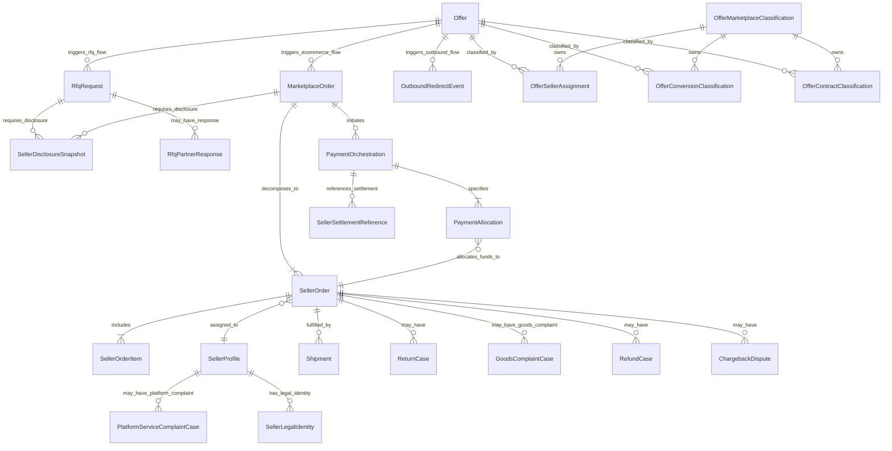

# LOGIMARKET MARKETPLACE LOGICAL DATA MODEL (LM-MARKETPLACE-DATA-MODEL-56B0)

DOCUMENT_ROLE=NORMATIVE_LOGICAL_DATA_MODEL_DRAFT
DOCUMENT_STATUS=READY_FOR_INDEPENDENT_LOGICAL_MODEL_REVIEW
SPRINT_TYPE=DOCUMENTATION_ONLY
PHYSICAL_SCHEMA_STATUS=NOT_DESIGNED
APPLICATION_IMPLEMENTATION_STATUS=NOT_STARTED

## 1. SCOPE AND EXCLUSIONS
This normative logical data model defines the Intermediary-First Marketplace architecture (R3). It establishes aggregate boundaries, elements, lifecycles, and invariants for multi-seller commerce. It excludes physical database schema (tables, Drizzle), which remains blocked pending independent logical-model review.

## 2. NORMATIVE SOURCE PRECEDENCE
1. R3 business approval record
2. R3 intermediary-first contract
3. R3 decision overlay
4. R3 implementation roadmap
5. historical R2B documents only where not superseded
6. current repository implementation facts

## 3. CANONICAL TERMINOLOGY
MVP_PLATFORM_ROLE=INTERMEDIARY_MARKETPLACE
MODEL_A_ACTIVE_IN_INITIAL_MVP=NO
FUTURE_RESELLER_CHANNEL_SUPPORTED=YES
FUTURE_RESELLER_CHANNEL_ENABLED=NO

CANONICAL_BUSINESS_KEY=offerModel
LOGICAL_REPRESENTATION=OfferConversionClassification

CURRENT_CONTRACT_MODEL_FIELD_EXISTS=NO
OFFER_MODEL_AND_CONTRACT_MODEL_CONFLATION_ALLOWED=NO
OFFER_MODEL_AND_CONTRACT_MODEL_ARE_INDEPENDENT=YES

offers.offerModel is the current conversion-mode field (rfq/ecommerce/outbound).
It is not equivalent to contractModel.
contractModel is a logical construct with no current physical field.
These two concepts are separately represented in the logical model:
  OfferConversionClassification — represents offers.offerModel (canonical business key: offerModel)
  OfferContractClassification  — represents contractModel (NO_CURRENT_ELEMENT)

## 4. APPROVED COMBINATION MATRIX

### Active MVP Combinations
1.
offerModel=rfq
contractModel=partner_marketplace
seller=Partner

2.
offerModel=ecommerce
contractModel=partner_marketplace
seller=Partner

3.
offerModel=outbound
contractModel=external_redirect
seller=External Partner

### Future Combinations
4.
offerModel=rfq
contractModel=logimarket_reseller
seller=LogiMarket
active_in_initial_mvp=NO

5.
offerModel=ecommerce
contractModel=logimarket_reseller
seller=LogiMarket
active_in_initial_mvp=NO

OUTBOUND_RESELLER_COMBINATION_ALLOWED=NO
AUTOMATIC_CONTRACT_MODEL_INFERENCE=NO
GLOBAL_RESELLER_SWITCH=NO

## 5. AGGREGATE BOUNDARIES

### Active Aggregate Boundaries (8)

1. SELLER_AND_OFFER_CLASSIFICATION
   Root 1: SellerProfile
   Owns: SellerLegalIdentity, SellerEligibility

   Root 2: OfferMarketplaceClassification
   Owns: OfferSellerAssignment, OfferConversionClassification, OfferContractClassification

   External Reference: Offer
   MODEL_ELEMENT_TYPE=EXTERNAL_REFERENCE
   OWNING_AGGREGATE_ROOT=EXTERNAL_CURRENT_OFFER_DOMAIN
   Note: Offer is the existing offers table entity. It is not owned by SellerProfile or OfferMarketplaceClassification. Classification aggregates reference it.

   Audit-only element: ConversionTypeField
   CURRENT_SCHEMA_AUDIT_REFERENCE_ONLY=YES
   Note: offers.conversionType requires further audit; its semantic relationship to offerModel is unresolved. Not elevated to normative aggregate element.

2. MARKETPLACE_ORDER_ORCHESTRATION
   Roots: RfqRequest, MarketplaceOrder (mutually exclusive per offerModel value)
   Note: RfqRequest is the conversion aggregate for offerModel=rfq.
   MarketplaceOrder is the conversion aggregate for offerModel=ecommerce.
   Contains: SellerDisclosureSnapshot (applies to both RfqRequest and MarketplaceOrder),
             RfqRoutingEvent, RfqPartnerResponse, RfqBuyerLegalContextSnapshot,
             EcommerceBuyerLegalContextSnapshot
   External Reference: BuyerIdentityReference (owned by EXTERNAL_BUYER_IDENTITY_DOMAIN)

3. SELLER_ORDER
   Root: SellerOrder
   Contains: SellerOrderItem, SellerResponsibilitySnapshot, SellerAcceptanceDecision,
             GoodsInvoiceResponsibilitySnapshot

4. PAYMENT_AND_ALLOCATION
   Root: PaymentOrchestration
   Contains: PSPTransactionReference, PaymentAllocation, SellerSettlementReference

5. PLATFORM_REVENUE_AND_SELLER_SETTLEMENT_REFERENCE
   Root: PlatformRevenueRecord
   Contains: PlatformServiceInvoiceReference

6. FULFILLMENT_AND_SHIPMENT
   Root: Shipment
   Contains: ShipmentItemAllocation, DeliveryEvent

7. AFTER_SALES_AND_DISPUTES
   Roots: ReturnCase, GoodsComplaintCase, PlatformServiceComplaintCase, RefundCase, ChargebackDispute
   GOODS_COMPLAINT_OWNER=PARTNER
   PLATFORM_SERVICE_COMPLAINT_OWNER=LOGIMARKET
   COMPLAINT_RESPONSIBILITY_CONFLATION_ALLOWED=NO
   CHARGEBACK_RESPONSIBILITY_OWNER=UNRESOLVED

8. AUDIT_IDEMPOTENCY_AND_PRIVACY
   Roots:
   - AuditJournal
   - IdempotencyRegistry
   - WebhookInboxMessage
   - OutboxDispatch
   - OutboundRedirectAuditLog

   Contains: DomainAuditEvent (owned by AuditJournal),
             IdempotencyRecord (owned by IdempotencyRegistry),
             OutboxMessage (owned by OutboxDispatch),
             OutboundRedirectEvent (owned by OutboundRedirectAuditLog),
             ExternalRedirectReference (owned by OutboundRedirectAuditLog),
             RetentionPolicySnapshot (owned by AuditJournal),
             PrivacyProcessingContext (owned by AuditJournal)

### Future Extension Boundaries (1)
FUTURE_LOGIMARKET_RESELLER_EXTENSION
Contains: FutureResellerActivationPolicy

## 6. LOGICAL INVARIANTS

INV-MKT-01: Every active partner-marketplace offer has one explicitly assigned seller identity and one explicitly assigned contractModel.
INV-MKT-02: The assignment may change prospectively, but historical commercial records retain immutable snapshots.
INV-MKT-03: A marketplace order is an orchestration envelope and is not itself proof of one buyer-to-all-sellers sales contract.
INV-MKT-04: A marketplace order may contain one or more seller orders.
INV-MKT-05: Each seller order belongs to exactly one seller.
INV-MKT-06: Each seller order contains items belonging only to its seller.
INV-MKT-07: Each seller order stores a contractModel snapshot.
INV-MKT-08: Each seller order stores seller identity and responsibility snapshots.
INV-MKT-09: Seller acceptance and contract formation must remain separately representable.
INV-MKT-10: Contract formation semantics remain unresolved until OMQ-MKT-01 and OMQ-MKT-02 are closed.
INV-MKT-11: Partner owns partner-marketplace goods revenue.
INV-MKT-12: Partner is responsible for the buyer goods invoice.
INV-MKT-13: LogiMarket platform revenue is separate from partner goods revenue.
INV-MKT-14: Platform revenue can be commission or a platform-service fee; final monetization remains unresolved.
INV-MKT-15: Payment allocation must be representable without LogiMarket self-custody or LogiMarket-operated escrow.
INV-MKT-16: The logical model must not require direct payment to Partner, split payment, net settlement or gross settlement.
INV-MKT-17: A refund has separate financial-liability and technical-execution concepts.
INV-MKT-18: Partner carries refund financial liability for partner marketplace.
INV-MKT-19: Technical refund executor remains unresolved.
INV-MKT-20: Goods complaints and platform-service complaints are distinct and have distinct responsibility owners.
INV-MKT-21: A seller order may have one-to-many shipments.
INV-MKT-22: Partial fulfillment requires buyer acceptance and must not occur silently.
INV-MKT-23: Parcel and pallet are selected MVP shipment modes.
INV-MKT-24: Manual/deferred freight e-commerce remains inactive.
INV-MKT-25: Outbound offers create no LogiMarket seller order or payment record.
INV-MKT-26: Outbound redirects use only /go/[id].
INV-MKT-27: Buyer legal context must not be inferred solely from NIP.
INV-MKT-28: Privacy-controller roles remain unresolved and configurable.
INV-MKT-29: Future reseller activation is explicit, offer-specific and disabled.
INV-MKT-30: No initial-MVP aggregate depends on activation of the future reseller channel.
INV-MKT-31: RFQ initial MVP does not create a MarketplaceOrder, SellerOrder or PaymentOrchestration.
INV-MKT-32: Outbound external redirect does not create any MarketplaceOrder or marketplace transaction.
INV-MKT-33: Domain reset preserves current RFQ, cart, checkout and outbound behavior without modification.
INV-MKT-34: GoodsComplaintCase and PlatformServiceComplaintCase have distinct responsibility owners and must not be conflated.

RFQ_CREATES_MARKETPLACE_ORDER_IN_INITIAL_MVP=NO
RFQ_CREATES_SELLER_ORDER_IN_INITIAL_MVP=NO
RFQ_REQUIRES_MARKETPLACE_PAYMENT_IN_INITIAL_MVP=NO
RFQ_TO_SELLER_ORDER_CONVERSION=FUTURE_WORKFLOW

RFQ_SELLER_DISCLOSURE_REQUIRED=YES
ECOMMERCE_SELLER_DISCLOSURE_REQUIRED=YES

OUTBOUND_CREATES_MARKETPLACE_ORDER=NO
OUTBOUND_CREATES_SELLER_ORDER=NO
OUTBOUND_CREATES_PAYMENT_ORCHESTRATION=NO

## 7. LOGICAL CARDINALITIES & OWNERSHIP
- MarketplaceOrder 1:N SellerOrder
- PaymentOrchestration 1:N PaymentAllocation
- PaymentAllocation N:1 SellerOrder
- SellerOrder 1:N SellerOrderItem
- SellerOrder 1:N Shipment

PAYMENT_ALLOCATION_STATUS_AUTHORITATIVE_IN_SELLER_ORDER=NO
PAYMENT_ALLOCATION_STATUS=DERIVED_PROJECTION_FROM_PAYMENT_AND_ALLOCATION

## 8. SNAPSHOT POLICY
SNAPSHOT_POLICY_REQUIRED=YES
HISTORICAL_RECORDS_FOLLOW_CURRENT_OFFER_ASSIGNMENT=NO

Required Immutable Snapshots at conversion or seller-order creation:
- seller legal identity;
- seller display identity;
- contractModel;
- Seller of Record responsibility;
- invoice responsibility;
- delivery responsibility;
- complaint responsibility;
- return responsibility;
- refund financial liability;
- offer identity;
- offer title;
- manufacturer and model where applicable;
- technical-data source reference;
- original partner-content language;
- quantity;
- unit price;
- currency;
- tax context where available;
- buyer legal-context evidence;
- customer PO number where supplied.

## 9. TRANSACTION AND CONSISTENCY BOUNDARIES
- rfq-request creation boundary;
- marketplace-order creation boundary;
- seller-order creation boundary;
- seller acceptance boundary;
- payment-reference boundary;
- payment-allocation boundary;
- shipment boundary;
- refund boundary;
- goods complaint boundary;
- platform-service complaint boundary;
- chargeback boundary;
- audit/event boundary.

Representation uses domain events, idempotency keys, webhook inbox, outbox, retry-safe external references. No one cross-seller database transaction for external PSP. No event bus or broker.

## 10. PSP ABSTRACTION
- seller KYB/KYC status reference;
- buyer payment intent;
- PSP transaction reference;
- abstract seller-order allocation (model unresolved);
- partial allocation;
- partial refund (technical executor unresolved);
- chargeback reference;
- reconciliation identifier;
- idempotency;
- webhook ingestion;
- settlement reference (model unresolved).

NO_LOGIMARKET_SELF_CUSTODY=YES
NO_LOGIMARKET_OPERATED_ESCROW=YES
PAYMENT_ALLOCATION_MODEL=UNRESOLVED
SELLER_PAYOUT_MODEL=UNRESOLVED
DIRECT_TO_PARTNER_PAYOUT_SELECTED=NO
SPLIT_PAYMENT_SELECTED=NO
REFUND_TECHNICAL_EXECUTOR=UNRESOLVED
PSP_PROVIDER_SELECTED=NO
PSP_ARCHITECTURE_SELECTED=NO

## 11. REFUND RESPONSIBILITIES
FINANCIAL_LIABILITY_OWNER=PARTNER
BUSINESS_DECISION_OWNER=PARTNER
PLATFORM_ORCHESTRATION_ROLE=LOGIMARKET
TECHNICAL_EXECUTOR=UNRESOLVED
REFUND_RESPONSIBILITY_DIMENSIONS_PRESENT=YES
REFUND_TECHNICAL_EXECUTOR_SELECTED=NO

## 12. FUTURE RESELLER ISOLATION
FUTURE_RESELLER_ACTIVE_IN_INITIAL_MVP=NO
AUTOMATIC_RESELLER_ACTIVATION=NO
GLOBAL_RESELLER_SWITCH=NO
OUTBOUND_RESELLER_COMBINATION_ALLOWED=NO
FUTURE_RESELLER_ACTIVATION_SPRINT=NOT_YET_SCHEDULED

## 13. LOGICAL MERMAID DIAGRAM

## 14. READINESS SUMMARY
The logical data model defines requirements and rules safely supporting MVP combinations while explicitly managing unresolved decisions through snapshotting and PSP abstractions.
